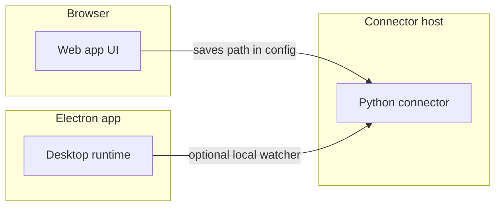

<div className="max-w-2xl mx-auto mt-12">
  <div className="p-6 border border-gray-200 dark:border-gray-700 rounded-lg bg-stone-50 dark:bg-gray-800">
    <div className="flex items-center mb-4">
      {/* Matches ConnectorIcon monochromeFilter: light brightness(0), dark brightness(0) invert(1). Separate imgs avoid competing filter utilities. */}
      <span className="mr-3 inline-flex h-8 w-8 flex-shrink-0 items-center justify-center dark:hidden" aria-hidden="true">
        
      </span>
      <span className="mr-3 hidden h-8 w-8 flex-shrink-0 items-center justify-center dark:inline-flex" aria-hidden="true">
        
      </span>
      <h2 className="text-2xl font-semibold m-0">Local FS</h2>
    </div>
    <p className="text-lg text-gray-700 dark:text-gray-300 mb-4">
      Index files from a folder on the machine where the connector service runs
    </p>
    <div className="flex items-center gap-2">
      <span className="px-3 py-1 bg-green-100 dark:bg-green-900 text-green-800 dark:text-green-200 rounded-full text-sm font-medium">
        ✅ Ready
      </span>
      <span className="px-3 py-1 bg-blue-100 dark:bg-blue-900 text-blue-800 dark:text-blue-200 rounded-full text-sm font-medium">
        📖 Documentation Available
      </span>
    </div>
  </div>
</div>

## What is this?

**Local FS** brings files from a **folder on disk** into PipesHub so you can **search them from chat and the knowledge base**.

PipesHub only **reads** those files. It does not move, rename, or delete anything on your disk.

This connector is **personal**: you set it up under **Personal → Your Connectors** in the sidebar, not from org-wide team connector admin.

### Where does the folder live?

The path you set must be readable by the **same environment that runs the Python connector** (the `connectors` / `connectors_main` process). That is not always the same as the laptop where you use the browser.



| Situation | What to do |
|-----------|------------|
| **Connector on your machine** | Use the real absolute path (for example `/Users/you/Documents/project`). |
| **Docker or Kubernetes** | **Mount** the host folder into the container, then set the **path inside the container** (for example host `/data` mounted as `/data` in the container → use `/data`). |
| **PipesHub desktop (Electron)** | The app can run a **local watcher** that lines up with your folder settings; behaviour matches the sync options you save in the UI. |

To verify a container sees your path:

```bash
docker compose exec <connectors-service> ls -la /path/you/configured
```

If that fails with “No such file” or “Permission denied”, sync will not index files until the mount and permissions are fixed.

### What you need before you start

1. A PipesHub account where you can open **Personal → Your Connectors** in the sidebar.
2. A folder you are allowed to read, on (or mounted into) the **connector host**.
3. Patience for the first sync if the folder is large — or use **filters** to limit file types and dates.

---

## Setup

<AccordionGroup type="single" collapsible>

<Accordion title="Setup" defaultOpen>

<div className="mt-4">

### Step 1 — Open Local FS from Your Connectors

1. In PipesHub, open the left sidebar.
2. Under **Personal**, click **Your Connectors**.
3. Use the **All**, **Active**, or **Inactive** filters at the top if needed (optional).
4. Find the **Local FS** card and click **+ Setup**.

<div className="text-center">
  
</div>

A **Local FS Configuration** panel opens (slide-out or modal, depending on your layout).

<Info>
  If your deployment requires saving sync settings while the instance is **inactive**, turn sync off first, change **Local folder** and options, then save — as described in the in-product connector help.
</Info>

---

### Step 2 — Name the instance (Authenticate tab)

The first tab is **Authenticate Instance**. Local FS uses **no cloud login** — you should see a banner such as **No authentication required for this connector.**

<div className="text-center">
  
</div>

1. Enter an **Instance name** you will recognise later (for example `My Computer` or `Work laptop notes`).
2. Click **Next →** at the bottom to continue.

---

### Step 3 — Choose folder, sync strategy, and options

Open the **Configure Records** tab.

<div className="text-center">
  
</div>

Under **Sync settings**:

- **Manual** — PipesHub only rescans when you press **Sync** / **Full sync** (or run an equivalent flow).
- **Scheduled** — set **Sync interval** (for example every hour) so the folder is rescanned automatically.

Under **Additional settings** (names may match your build):

- **Local folder** — use **Choose folder** (or the path field) so the configured path is the one the **connector process** can read.
- **Include subfolders** — on by default; turn off to index only the top level of the folder.
- **Batch size** — optional tuning for how many items are processed per batch.

<Warning>
  **Turning sync “on” does not crawl by itself.** You still need a **manual sync** or a **schedule** so files are actually walked and sent for indexing.
</Warning>

---

### Step 4 — (Optional) Filters and indexing toggles

Scroll to **Indexing & sync filters** (sometimes split into **Sync filters**, **Indexing filters**, and optional **Enable manual indexing**). Use **+ Add filter** to limit by **file extensions**, **modified date**, **created date**, and related fields offered for Local FS.

<div className="text-center">
  
</div>

Indexing toggles (when shown) control whether **files**, **documents**, **images**, **videos**, or **attachment-like** types are indexed — mirror how you use other file connectors.

When finished, click **Save Configuration**.

---

### Step 5 — Enable sync on your instance

Go to **Personal → Your Connectors**, open **Local FS** so you see the breadcrumb **Connectors → Local FS** and your instance card (for example *My Computer*).

<div className="text-center">
  
</div>

1. Find **Sync enabled** on the instance (**SYNC ENABLED** in uppercase on some layouts).
2. Turn it **on** when you are ready for PipesHub to run syncs according to your strategy.

---

### Step 6 — Run a sync and check progress

For **Manual** strategy, open the instance and use **Sync** or **Full sync** so the first crawl runs.

Click the row to open the **Overview** panel.

<div className="text-center">
  
</div>

Here you can see record metrics such as **Total**, **Completed**, **Processing**, **Failed**, and **Queued**, plus **Sync now**, **Manage Configuration**, and (on the connector page behind the panel) **Sync** / **Full sync**.

That's it — your folder’s files can appear in PipesHub search as indexing completes.

</div>

</Accordion>

<Accordion title="How syncing works">

<div className="mt-4">

### First sync

The first successful sync walks the folder (respecting **Include subfolders** and filters) and registers files. Very large trees take longer; narrowing **file extensions** or **date ranges** speeds things up.

### Later syncs

Later runs pick up **new**, **changed**, and **removed** files so search stays in sync with disk.

### Who can see the content?

Local FS is **personal** — only your PipesHub user searches this data inside the product. It does not change file permissions on disk.

### Optional CLI

Advanced users can use the **Pipeshub CLI** (`pipeshub login`, `pipeshub setup`, `pipeshub run` / `pipeshub sync`) to point a personal Local FS instance at a path and trigger resyncs. The CLI does not replace the requirement that the **Python connector** can read that path on the host. See the CLI package README under the repository’s Node apps.

</div>

</Accordion>

<Accordion title="What PipesHub can read">

<div className="mt-4">

### Indexed for search

Text-heavy formats are parsed so you can search **inside** the file:

- Documents — **PDF**, **DOCX**, **PPTX**, **XLSX**, **ODT**, **RTF**
- Plain text — **TXT**, **MD**, **CSV**, **JSON**, **XML**, **HTML**
- Code — **.py**, **.js**, **.ts**, **.java**, and similar

### Synced but limited text search

Binary types may appear as records (by name and metadata) even when full-text extraction is limited:

- Images, video, audio
- Archives and other binaries

Exact behaviour follows your **indexing** toggles and the indexing pipeline version deployed in your environment.

</div>

</Accordion>

</AccordionGroup>

---

## Troubleshooting

<AccordionGroup type="single" collapsible>

<Accordion title="The connector cannot see my folder">

- Confirm the path is valid **inside the connector container or host**, not only on your workstation.
- For Docker: fix **volume mounts** and use the **in-container** path.
- Check **POSIX / Windows** path style matches the OS of the connector process.

</Accordion>

<Accordion title="Sync runs but I see 0 files">

- The folder might be empty, or filters might exclude everything (extensions, dates).
- **Include subfolders** might be off while all files live in subdirectories.
- Verify with `ls` (or Explorer) on the connector host that files exist where you think they do.

</Accordion>

<Accordion title="Files never show up in search">

- Allow time for the **indexing** workers to process `newRecord` events after sync.
- Confirm the file type is one that supports text extraction (see **What PipesHub can read**).
- Password-protected PDFs or Office files may not index until unlocked.

</Accordion>

<Accordion title="Scheduled sync never seems to run">

- Confirm **Scheduled** is selected and **Sync interval** is set as expected.
- Check that **Sync enabled** (**SYNC ENABLED**) is on and the connector process is healthy (logs, uptime).

</Accordion>

<Accordion title="It worked locally but broke after deploy">

- Re-check mounts and paths in the new environment.
- If the connector moved to another node without the same volume, update **Local folder** to the new mount path and save.

</Accordion>

</AccordionGroup>

---

## Frequently asked questions

<AccordionGroup type="single" collapsible>

<Accordion title="Does PipesHub modify or delete my files?">
  No. The connector **reads** files to build search records. It does not write back to your folder for normal indexing.
</Accordion>

<Accordion title="Can I use Local FS for my whole team?">
  The connector is registered as **personal**. Each user who needs local indexing should use their own instance and folder scope inside PipesHub.
</Accordion>

<Accordion title="What happens if I delete a file on disk?">
  On a later sync, PipesHub can detect it is gone and remove it from search results, subject to connector and indexing behaviour in your release.
</Accordion>

<Accordion title="Can I connect more than one folder?">
  Add **another instance** of Local FS from **Personal → Your Connectors** (open Local FS → **+ Add Another Instance**) and point each instance at a different path (name them clearly).
</Accordion>

<Accordion title="Do I need the CLI?">
  No. The web (and desktop) flows are enough for most users. The CLI is optional for automation and developer workflows.
</Accordion>

</AccordionGroup>

---

## Useful links

- **Connectors overview** — [https://docs.pipeshub.com/connectors/overview](https://docs.pipeshub.com/connectors/overview)
