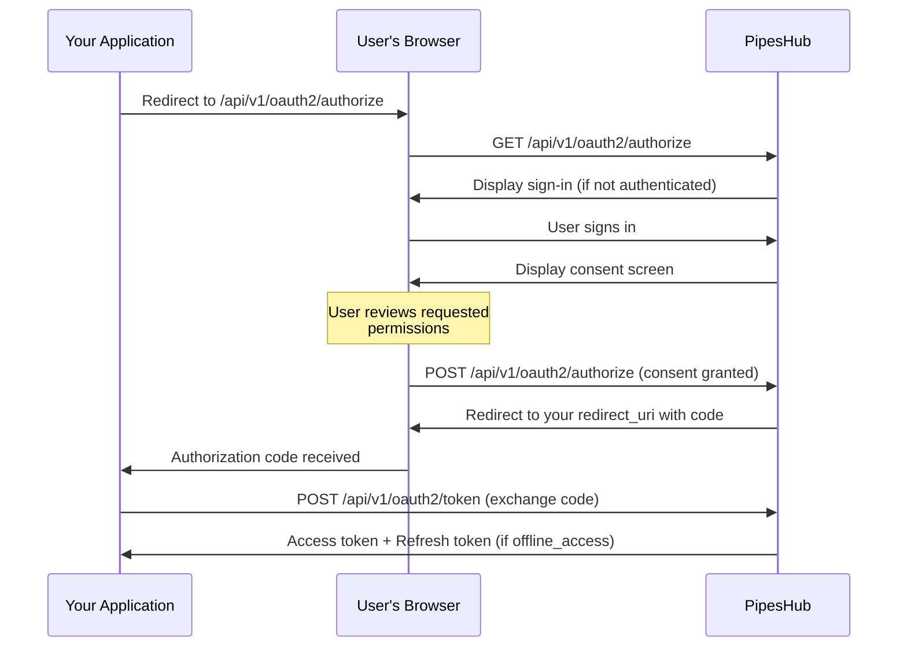

PipesHub provides a built-in OAuth 2.0 authorization server that allows administrators to register third-party applications and control how they access organizational data. This guide walks through the complete process of creating, configuring, and managing OAuth applications.

---

## Who Can Manage OAuth Applications

OAuth application management is available exclusively to **administrators**. Only users with admin privileges can create, edit, suspend, or delete OAuth applications within the organization.

---

## Navigating to OAuth Settings

To access the OAuth application management page:

1. Sign in to your PipesHub account with administrator credentials
2. Navigate to **Connector Settings** from the Navbar
3. Select **OAuth 2.0 Apps** under the **Developer Settings** section

<div style={{ textAlign: "center", padding: "10px" }}>
  
</div>

This page displays all registered OAuth applications along with their current status (active or suspended).

---

## Creating a New OAuth Application

Follow these steps to register a new OAuth application.

### Step 1: Open the Application Registration Form

From the **OAuth 2.0 Apps** page, click the **New OAuth application** button.

<div style={{ textAlign: "center", padding: "10px" }}>
  
</div>

### Step 2: Provide Application Details

Fill in the following fields:

| Field | Required | Description |
|-------|----------|-------------|
| **Application Name** | Yes | A descriptive name for the application (1-100 characters). This name is displayed to users during the consent process. |
| **Description** | No | A brief explanation of what the application does (up to 500 characters). Helps users understand why they are granting access. |
| **Homepage URL** | No | The URL of the application's homepage or landing page. |
| **Privacy Policy URL** | No | Link to the application's privacy policy. |
| **Terms of Service URL** | No | Link to the application's terms of service. |

<Tip>
  Providing a clear description and relevant URLs builds trust with users who are asked to grant access to their data during the consent flow.
</Tip>

### Step 3: Configure Grant Types

Select the authorization grant types that your application requires:

<AccordionGroup>

<Accordion title="Authorization Code (Recommended)">

The **Authorization Code** grant is the most common and secure flow. It is suitable for applications that have a backend server capable of securely storing credentials.

**How it works:**
1. The application redirects the user to PipesHub's authorization page
2. The user reviews the requested permissions and grants consent
3. PipesHub redirects the user back to your application with a temporary authorization code
4. Your application exchanges this code for an access token on the server side

This grant type supports **PKCE (Proof Key for Code Exchange)**, which is required for public clients such as mobile applications or single-page applications that cannot securely store a client secret.

</Accordion>

<Accordion title="Client Credentials">

The **Client Credentials** grant is designed for server-to-server communication where no user interaction is involved. The application authenticates directly using its client ID and client secret.

**When to use:**
- Background services or automation scripts
- Machine-to-machine integrations
- Scheduled tasks that access organizational data

</Accordion>

<Accordion title="Refresh Token">

The **Refresh Token** grant allows your application to obtain a new access token without requiring the user to re-authenticate. This is enabled automatically when the `offline_access` scope is requested during the authorization code flow.

**Key details:**
- Refresh tokens are rotated on each use — the old token is revoked and a new one is issued
- Your application should always store the latest refresh token
- Refresh tokens have a default lifetime of 30 days (configurable per application)

</Accordion>

</AccordionGroup>

### Step 4: Add Redirect URIs

Redirect URIs define where PipesHub sends users after they authorize (or deny) access. You may register up to **10 redirect URIs** per application.

<div style={{ textAlign: "center", padding: "10px" }}>
  
</div>

**Requirements:**
- All redirect URIs must use **HTTPS**, except for `localhost` and `127.0.0.1` (permitted for local development)
- The URI provided during the authorization request must exactly match one of the registered URIs
- Redirect URIs are required when the Authorization Code grant type is enabled

### Step 5: Select Scopes

Scopes define the specific permissions your application is requesting. Select only the scopes your application genuinely needs — following the principle of least privilege.

<div style={{ textAlign: "center", padding: "10px" }}>
  
</div>

Scopes are organized by category for ease of selection. The following table provides a complete reference:

<AccordionGroup>

<Accordion title="Identity & Access Scopes">

| Scope | Description |
|-------|-------------|
| `openid` | Required for OpenID Connect. Returns a unique user identifier. |
| `profile` | Access to the user's basic profile information. |
| `email` | Access to the user's email address. |
| `offline_access` | Enables refresh tokens for long-lived sessions without repeated user consent. |

</Accordion>

<Accordion title="Organization Scopes">

| Scope | Description |
|-------|-------------|
| `org:read` | View organization details and settings. |
| `org:write` | Modify organization settings and configuration. |
| `org:admin` | Full administrative access to organization management. |

</Accordion>

<Accordion title="User Management Scopes">

| Scope | Description |
|-------|-------------|
| `user:read` | View user profiles and details. |
| `user:write` | Modify user information and settings. |
| `user:invite` | Invite new users to the organization. |
| `user:delete` | Remove users from the organization. |

</Accordion>

<Accordion title="User Groups & Teams Scopes">

| Scope | Description |
|-------|-------------|
| `usergroup:read` | View user groups and their members. |
| `usergroup:write` | Create, modify, or delete user groups. |
| `team:read` | View team information. |
| `team:write` | Create, modify, or delete teams. |

</Accordion>

<Accordion title="Knowledge Base Scopes">

| Scope | Description |
|-------|-------------|
| `kb:read` | View knowledge base content and records. |
| `kb:write` | Create and modify knowledge base content. |
| `kb:delete` | Delete knowledge base records. |
| `kb:upload` | Upload files and documents to the knowledge base. |

</Accordion>

<Accordion title="Search & Conversations Scopes">

| Scope | Description |
|-------|-------------|
| `semantic:read` | Perform semantic search queries. |
| `semantic:write` | Create and modify search indexes. |
| `semantic:delete` | Delete search indexes or entries. |
| `conversation:read` | View conversations and chat history. |
| `conversation:write` | Create and modify conversations. |
| `conversation:chat` | Send messages and interact in real-time conversations. |

</Accordion>

<Accordion title="Agents Scopes">

| Scope | Description |
|-------|-------------|
| `agent:read` | View agent configurations and details. |
| `agent:write` | Create and modify agent configurations. |
| `agent:execute` | Execute agents and trigger agent workflows. |

</Accordion>

<Accordion title="Connectors Scopes">

| Scope | Description |
|-------|-------------|
| `connector:read` | View connector configurations and status. |
| `connector:write` | Create and modify connector configurations. |
| `connector:sync` | Trigger data synchronization for connectors. |
| `connector:delete` | Remove connector instances. |

</Accordion>

<Accordion title="Configuration & Storage Scopes">

| Scope | Description |
|-------|-------------|
| `config:read` | View system configuration settings. |
| `config:write` | Modify system configuration settings. |
| `document:read` | Read files and documents from storage. |
| `document:write` | Upload and modify files in storage. |
| `document:delete` | Delete files from storage. |

</Accordion>

<Accordion title="Crawling Scopes">

| Scope | Description |
|-------|-------------|
| `crawl:read` | View crawling jobs and their status. |
| `crawl:write` | Create and modify crawling jobs. |
| `crawl:delete` | Delete crawling jobs. |

</Accordion>

</AccordionGroup>

### Step 6: Save and Store Credentials

After submitting the form, PipesHub generates a unique **Client ID** and **Client Secret** for your application.

<div style={{ textAlign: "center", padding: "10px" }}>
  
</div>

<Warning>
  The **Client Secret** is displayed only once at the time of creation. Copy and store it in a secure location immediately. If lost, you will need to regenerate the secret, which invalidates the previous one.
</Warning>

---

## Authorization Flow

The following diagram illustrates how the OAuth 2.0 Authorization Code flow operates within PipesHub.



### Step-by-Step Breakdown

<Steps>

<Step title="Initiate Authorization">
Your application redirects the user's browser to PipesHub's authorization endpoint with the required parameters:

```
GET /api/v1/oauth2/authorize?
  response_type=code&
  client_id=YOUR_CLIENT_ID&
  redirect_uri=YOUR_REDIRECT_URI&
  scope=openid profile email&
  state=RANDOM_STATE_VALUE
```

**For public clients (PKCE)**, include additional parameters:

```
  &code_challenge=GENERATED_CHALLENGE
  &code_challenge_method=S256
```

</Step>

<Step title="User Authentication">
If the user is not already signed in to PipesHub, they are redirected to the sign-in page. After successful authentication, they are directed to the consent screen.
</Step>

<Step title="User Consent">
The consent screen displays your application's name, description, and the specific permissions being requested. The user can choose to **Allow** or **Deny** access.

<div style={{ textAlign: "center", padding: "10px" }}>
  
</div>

</Step>

<Step title="Authorization Code">
Upon approval, PipesHub redirects the user's browser back to your registered redirect URI with a temporary authorization code:

```
https://your-app.com/callback?code=AUTHORIZATION_CODE&state=RANDOM_STATE_VALUE
```

</Step>

<Step title="Exchange Code for Tokens">
Your application exchanges the authorization code for tokens by making a server-side request:

```bash
curl -X POST https://your-pipeshub-instance.com/api/v1/oauth2/token \
  -H "Content-Type: application/x-www-form-urlencoded" \
  -d "grant_type=authorization_code" \
  -d "code=AUTHORIZATION_CODE" \
  -d "redirect_uri=YOUR_REDIRECT_URI" \
  -d "client_id=YOUR_CLIENT_ID" \
  -d "client_secret=YOUR_CLIENT_SECRET"
```

**For PKCE**, include the `code_verifier` instead of `client_secret`:

```bash
  -d "code_verifier=YOUR_CODE_VERIFIER"
```

**Successful response:**

```json
{
  "access_token": "eyJhbGciOiJIUzI1NiIs...",
  "token_type": "Bearer",
  "expires_in": 3600,
  "refresh_token": "dGhpcyBpcyBhIHJlZnJl...",
  "scope": "openid profile email"
}
```

</Step>

<Step title="Access Protected Resources">
Use the access token to make API requests on behalf of the user:

```bash
curl -X GET https://your-pipeshub-instance.com/api/v1/resource \
  -H "Authorization: Bearer ACCESS_TOKEN"
```

</Step>

</Steps>

---

## Client Credentials Flow

For server-to-server integrations that do not require user context:

```bash
curl -X POST https://your-pipeshub-instance.com/api/v1/oauth2/token \
  -H "Content-Type: application/x-www-form-urlencoded" \
  -d "grant_type=client_credentials" \
  -d "client_id=YOUR_CLIENT_ID" \
  -d "client_secret=YOUR_CLIENT_SECRET" \
  -d "scope=kb:read semantic:read"
```

---

## Refreshing Tokens

When an access token expires, use the refresh token to obtain a new one without requiring user interaction:

```bash
curl -X POST https://your-pipeshub-instance.com/api/v1/oauth2/token \
  -H "Content-Type: application/x-www-form-urlencoded" \
  -d "grant_type=refresh_token" \
  -d "refresh_token=YOUR_REFRESH_TOKEN" \
  -d "client_id=YOUR_CLIENT_ID" \
  -d "client_secret=YOUR_CLIENT_SECRET"
```

<Warning>
  PipesHub uses **refresh token rotation**. Each time you refresh, the previous refresh token is revoked and a new one is issued. Always store and use the most recent refresh token from the response.
</Warning>

---

## Revoking Tokens

To revoke an access token or refresh token when it is no longer needed:

```bash
curl -X POST https://your-pipeshub-instance.com/api/v1/oauth2/revoke \
  -H "Content-Type: application/x-www-form-urlencoded" \
  -d "token=TOKEN_TO_REVOKE" \
  -d "token_type_hint=access_token" \
  -d "client_id=YOUR_CLIENT_ID" \
  -d "client_secret=YOUR_CLIENT_SECRET"
```

Set `token_type_hint` to either `access_token` or `refresh_token` to help the server identify the token type more efficiently.

---

## OpenID Connect Discovery

PipesHub supports OpenID Connect Discovery, enabling clients to automatically discover OAuth endpoints and configuration:

| Endpoint | URL |
|----------|-----|
| **OpenID Configuration** | `/.well-known/openid-configuration` |
| **OAuth Authorization Server Metadata** | `/.well-known/oauth-authorization-server` |
| **JSON Web Key Set (JWKS)** | `/.well-known/jwks.json` |

These endpoints are publicly accessible and do not require authentication. They are particularly useful for MCP (Model Context Protocol) clients and other automated integrations that need to discover authorization server capabilities dynamically.

---

## Managing OAuth Applications

### Viewing Application Details

Click on any application from the list to view its configuration, including the client ID, allowed scopes, grant types, redirect URIs, and token settings.

<div style={{ textAlign: "center", padding: "10px" }}>
  
</div>

### Regenerating the Client Secret

If your client secret has been compromised or needs to be rotated:

1. Open the application detail page
2. Click **Generate new client secret**
3. Copy and securely store the new secret immediately

<Warning>
  Regenerating the client secret immediately invalidates the previous secret. Any active integrations using the old secret will stop functioning until updated.
</Warning>

### Suspending an Application

If you need to temporarily disable an application without deleting it:

1. Open the application detail page
2. Go to Advanced section in sidebar
3. Click **Suspend Application**

A suspended application cannot authorize new users or issue tokens. Existing tokens remain valid until they expire. To restore access, click **Activate application** on the same page.

### Deleting an Application

Deleting an OAuth application:

1. Revokes all active access tokens and refresh tokens associated with the application
2. Permanently marks the application as revoked

Steps to delete an application:
1. Open the application detail page
2. Go to Advanced section in sidebar
3. Click **Delete Application**
4. Confirm by putting the application name in dialog box

<Warning>
  Application deletion is irreversible. All active integrations will lose access immediately.
</Warning>

### Revoking Active Tokens

From the application detail page, administrators can:

- **Revoke all tokens** at once, which is useful in the event of a security incident

Steps to revoke all tokens:
1. Open the application detail page
2. Go to Advanced section in sidebar
3. Click **Revoke all tokens**
4. Confirm by putting the application name in dialog box

---

## Security Best Practices

<CardGroup cols={2}>

<Card title="Store Secrets Securely" icon="vault">
  Never expose client secrets in frontend code, public repositories, or client-side applications. Use environment variables or a dedicated secrets manager.
</Card>

<Card title="Use PKCE for Public Clients" icon="shield-check">
  Public clients (mobile apps, SPAs) must use PKCE with the S256 challenge method to protect against authorization code interception attacks.
</Card>

<Card title="Request Minimal Scopes" icon="minimize">
  Only request the scopes your application genuinely needs. Users are more likely to trust and approve applications with narrowly defined permissions.
</Card>

<Card title="Validate the State Parameter" icon="fingerprint">
  Always generate a unique, unpredictable `state` value for each authorization request and verify it in the callback to prevent cross-site request forgery (CSRF) attacks.
</Card>

<Card title="Handle Token Rotation" icon="rotate">
  Always store the latest refresh token after each refresh operation. Using an outdated refresh token will fail and may trigger a security alert.
</Card>

<Card title="Revoke Tokens on Sign-Out" icon="right-from-bracket">
  When users sign out of your application or disconnect the integration, revoke both access and refresh tokens to maintain a clean security posture.
</Card>

</CardGroup>

---

## API Endpoints Reference

The following table provides a quick reference for all OAuth 2.0 endpoints:

| Endpoint | Method | Description |
|----------|--------|-------------|
| `/api/v1/oauth2/authorize` | `GET` | Initiate the authorization flow |
| `/api/v1/oauth2/authorize` | `POST` | Submit user consent |
| `/api/v1/oauth2/token` | `POST` | Exchange code for tokens, refresh tokens, or client credentials |
| `/api/v1/oauth2/revoke` | `POST` | Revoke an access or refresh token |
| `/api/v1/oauth2/introspect` | `POST` | Inspect a token's validity and metadata |
| `/api/v1/oauth2/userinfo` | `GET` | Retrieve user profile information (requires `openid` scope) |
| `/.well-known/openid-configuration` | `GET` | OpenID Connect Discovery document |
| `/.well-known/jwks.json` | `GET` | Public keys for token verification |

---

## Troubleshooting

<AccordionGroup>

<Accordion title="Authorization request returns an error">

**Common causes:**
- The `redirect_uri` does not exactly match one of the registered URIs for the application
- The `client_id` is incorrect or belongs to a suspended/deleted application
- The requested scopes include scopes that are not in the application's allowed scopes

**Resolution:** Verify the client ID, redirect URI, and scopes in your application settings.

</Accordion>

<Accordion title="Token exchange fails with 'invalid_grant'">

**Common causes:**
- The authorization code has expired (codes are valid for 10 minutes)
- The authorization code has already been used
- The `redirect_uri` in the token request does not match the one used during authorization
- For PKCE: the `code_verifier` does not match the original `code_challenge`

**Resolution:** Initiate a new authorization request and ensure the code is exchanged promptly.

</Accordion>

<Accordion title="Refresh token is rejected">

**Common causes:**
- The refresh token has been rotated and the old token was used instead of the most recent one
- The refresh token has expired
- The application or its tokens have been revoked by an administrator

**Resolution:** Redirect the user through the authorization flow again to obtain new tokens.

</Accordion>

<Accordion title="API request returns 403 Forbidden">

**Common causes:**
- The access token does not include the required scope for the requested endpoint
- The user does not have sufficient permissions within the organization

**Resolution:** Check the scope requirements for the endpoint and ensure your application requests the appropriate scopes.

</Accordion>

</AccordionGroup>

---

## FAQ

<AccordionGroup>

<Accordion title="Can non-admin users create OAuth applications?">
No. OAuth application management is restricted to organization administrators. Regular users can only interact with OAuth applications during the consent flow when an application requests access to their data.
</Accordion>

<Accordion title="What happens when I regenerate a client secret?">
The previous secret is immediately invalidated. Any integration using the old secret will receive authentication errors. You must update all services that use the old secret with the new one.
</Accordion>

<Accordion title="Is there a limit on the number of OAuth applications?">
There is no fixed limit on the number of OAuth applications per organization. However, each application can have a maximum of 10 registered redirect URIs.
</Accordion>

<Accordion title="Does PipesHub support PKCE?">
Yes. PKCE (Proof Key for Code Exchange) is fully supported and is required for public (non-confidential) clients. PipesHub supports both `S256` and `plain` challenge methods, though `S256` is strongly recommended.
</Accordion>

</AccordionGroup>
