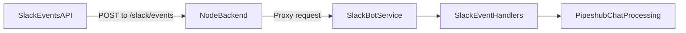

## Overview

This guide explains the full setup for Slack bot integration in Pipeshub:

1. Create a Slack app using a manifest.
2. Configure Slack Events API request URL.
3. Install the app and collect credentials.
4. Add the configuration in Pipeshub frontend.


## Prerequisites

- A HTTPS Node backend base URL (placeholder: `{node_backend_url}`).
- Admin access in the target Slack workspace.
- Pipeshub admin access (Slack Bot settings page is admin-only).

## Request Flow



- Slack sends events to `{node_backend_url}/slack/events`.
- Main Node backend proxies this path to the internal Slack bot service.
- Slack signatures are validated before events are processed.

## Step 1: Create Slack App From Manifest


1. Open Slack API: `https://api.slack.com/apps`
2. Click **Create New App**.
3. Choose **From an app manifest**.
4. Select your Slack workspace.
5. Paste a manifest like the following (replace values of "name" and "display_name" as needed, No need of any change in scopes & events):
6. Set **Request URL** to below URL in the manifest below:

```text
{node_backend_url}/slack/events
```


```json
{
  "display_information": {
    "name": "Pipeshub Agent-3"
  },
  "features": {
    "bot_user": {
      "display_name": "Pipeshub Agent-3",
      "always_online": false
    }
  },
  "oauth_config": {
    "scopes": {
      "bot": [
        "app_mentions:read",
        "channels:history",
        "files:read",
        "groups:history",
        "im:history",
        "users:read",
        "chat:write",
        "chat:write.public",
        "groups:read",
        "im:write",
        "users:read.email"
      ]
    }
  },
  "settings": {
    "event_subscriptions": {
      "request_url": "{node_backend_url}/slack/events",
      "bot_events": [
        "app_mention",
        "file_shared",
        "message.channels",
        "message.groups",
        "message.im"
      ]
    },
    "org_deploy_enabled": false,
    "socket_mode_enabled": false,
    "token_rotation_enabled": false
  }
}
```


### Manifest Field Notes

- `display_information.name`: App name shown on slack apps webpage (https://api.slack.com/apps).
- `features.bot_user.display_name`: App name visible inside Slack App.
- `oauth_config.scopes.bot`: Bot token permissions.
- `settings.event_subscriptions.request_url`: Must be your backend event endpoint.
- `settings.event_subscriptions.bot_events`: Events Slack should deliver to your bot.


### Important Rules

- URL must be publicly reachable over HTTPS.
- URL must not require custom auth middleware in front of Slack.


## Step 3: Install App And Copy Credentials

1. In Slack app settings, open **Install App**.
2. Click **Install to Workspace** (or reinstall if scopes changed).
3. Collect:
   - **Bot User OAuth Token** (starts with `xoxb-`)
   - **Signing Secret**

You will use these values in Pipeshub Slack Bot settings.

## Step 4: Configure Slack Bot In Pipeshub Frontend

### Navigation

- **Account** -> **Settings** -> **Slack Bot**
- Route path: `/account/company-settings/settings/slack-bot`

### Add Bot Configuration

Click **Add Slack Bot** and fill:

- **Slack Bot Name**: Friendly display name in Pipeshub.
- **Bot Token**: Paste Slack **Bot User OAuth Token**.
- **Signing Secret**: Paste Slack app signing secret.
- **Agent (Optional)**: Select a specific agent, or leave empty to use default/global chatbot handling.

Click **Add Slack Bot** (or **Save Changes** in edit mode).

### Validation And Management Behavior

- Name, Bot Token, and Signing Secret are required.
- Existing configurations can be managed via **Manage**.
- Configurations can be removed via **Delete**.
- Each config can be linked to an optional agent for routing behavior.

## Canonical OAuth Bot Scopes

The following scopes are used exactly as provided in your manifest:

| Scope | Why it is needed |
| --- | --- |
| `app_mentions:read` | Receive `@bot` mention events in channels. |
| `channels:history` | Read message history in public channels. |
| `files:read` | Access file metadata/content references shared in Slack. |
| `groups:history` | Read message history in private channels. |
| `im:history` | Read message history in direct messages. |
| `users:read` | Resolve Slack user profile basics. |
| `chat:write` | Send bot replies/messages to Slack conversations. |
| `chat:write.public` | Post in public channels where needed. |
| `groups:read` | Read private channel metadata/access context. |
| `im:write` | Open/send direct messages as bot. |
| `users:read.email` | Read user email metadata when needed for identity mapping. |

## Canonical Subscribed Bot Events

The following events are subscribed exactly as provided in your manifest:

| Event | Why it is subscribed |
| --- | --- |
| `app_mention` | Trigger bot processing when users mention the app in channels. |
| `file_shared` | Notify bot flow when files are shared in Slack. |
| `message.channels` | Receive message activity in public channels. |
| `message.groups` | Receive message activity in private channels. |
| `message.im` | Receive direct message activity between users and the bot. |

## End-To-End Verification Checklist

After setup, verify all layers:

1. Slack app created successfully from manifest.
2. Event Subscriptions Request URL verified in Slack.
3. App installed to workspace after any scope/event changes.
4. Bot token + signing secret saved in Pipeshub Slack Bot settings.
5. Send test interactions:
   - Mention bot in a channel (`@YourBot hello`)
   - Send a direct message to the bot

## Troubleshooting

### Request URL verification fails

- Confirm URL is exactly `{node_backend_url}/slack/events`.
- Confirm backend is reachable from the public internet.
- Confirm TLS/HTTPS certificate is valid.
- Confirm Node backend is running and Slack bot service is reachable internally.

### 401 errors from Slack event delivery

- Confirm Signing Secret in Pipeshub matches Slack app Signing Secret.
- Confirm system clock skew is not larger than 5 minutes.

### Bot does not respond in Pipeshub flow

- Confirm app was reinstalled after manifest scope changes.
- Confirm Bot Token entered is a valid `xoxb-` token.
- Confirm the expected bot events are enabled in Event Subscriptions.
- Confirm bot configuration exists in Pipeshub and is not deleted.

### Pipeshub save form errors

- Ensure all required fields are non-empty:
  - Slack Bot Name
  - Bot Token
  - Signing Secret

## Security Notes

- Treat Bot Token and Signing Secret as secrets.
- Rotate credentials immediately if exposed.
- Use production HTTPS backend URL in production.

