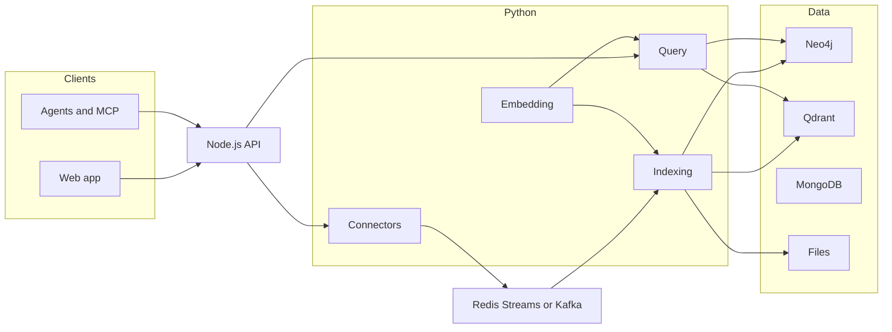

PipesHub has three parts. They share one permission model: a person in the UI and an agent on MCP see the same records.

## Web app

[Next.js](https://nextjs.org/). Search, chat, and admin in the browser. It talks to the API over HTTP and SSE. Express does not serve this app.

## API

Node.js (Express) on the same host as the UI in a typical Compose install. Accounts, permissions, knowledge bases, files, OAuth, personal access tokens, and **`/mcp`**.

Storage, mail, notifications, configuration, and crawl scheduling are modules in this process, not separate microservices. Operator pages for those modules: [storage](/system-overview/storage), [authentication](/system-overview/authentication), [mail](/system-overview/mail-service).

## Python services

- **Connectors** — OAuth, token refresh, and sync from Slack, Drive, Jira, and the other sources into the graph.
- **Indexing** — parse, chunk, embed; write vectors and graph nodes.
- **Query** — retrieval and the cited answer. Calls the LLM you configured.
- **Embedding** — local dense embeddings (OpenAI-compatible `/v1/embeddings`) when you are not using a cloud embedding provider. Indexing and query call it. Cloud embedding providers do not need this process.
- **Docling** — heavier PDF, table, and OCR parsing.
- **Parsing** and **Extraction** — optional. Start them only with `USE_PARSING_SERVICE=true`.

## How work moves

Connectors publish records; indexing consumes them:

- On a local machine: **Redis Streams** (`MESSAGE_BROKER=redis`). No Kafka containers.
- In a larger deployment: **Kafka** (`MESSAGE_BROKER=kafka`).

Redis is also the cache, and the default store for encrypted config. **etcd** is the other key-value option (`KV_STORE` / the `kv-etcd` Compose profile). A default laptop install does not start etcd.

## Data

- **Graph** — Neo4j by default (`DATA_STORE=neo4j`). ArangoDB is the other option. Same features either way; services go through the graph abstraction, not a vendor driver.
- **Vectors** — Qdrant by default (`VECTOR_DB_TYPE=qdrant`).
- **Documents** — MongoDB (sessions, file metadata, application state).
- **Files** — local disk, S3, Azure Blob, or GCS. See [storage](/system-overview/storage).
- **Redis** — cache; default KV; Redis Streams when that is the broker.
- **etcd** — optional KV, not the installer default.

Datastore notes and vendor links: [external services](/system-overview/external-services).

## Models

You bring the models. An **embedding model** turns parsed text into vectors. An **LLM** writes the cited answer. Any provider, or local (Ollama). The local embedding server is the default for vectors.

## Agents

The API exposes MCP at `/mcp` (Streamable HTTP). Same access checks as a signed-in user. Setup: [MCP overview](/mcp/overview).
